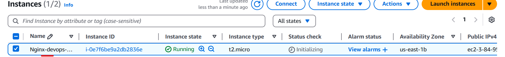
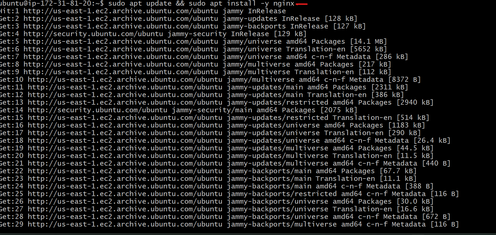
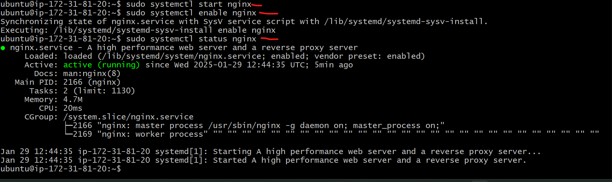
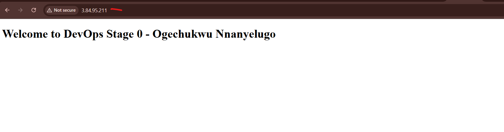

# setting up and configuring NGINX for DevOps stage 0

## Introduction

As part of the HNG Internship DevOps Stage 0 task, I was required to set up and configure NGINX on an Ubuntu server. The goal was to install NGINX, configure it to serve a custom HTML page, and make it accessible via a public IP address.


__Setting up an Ubuntu Server__

I provisioned a fresh Ubuntu instance on AWS EC2. While creating the instance, I ensured that inbound security group rules allowed HTTP (port 80) and SSH (port 22) access.





__Installing NGINX__

After SSH-ing into my server, I installed NGINX using the following commands:

```
sudo apt update && sudo apt install -y nginx
sudo systemctl enable nginx
sudo systemctl start nginx
sudo systemctl status nginx
```






Once confirmed, I accessed the server’s public IP in my browser `http://3.84.95.211/`, and the default NGINX welcome page was displayed.


__Configuring a Custom HTML Page__

`sudo nano /var/www/html/index.html`

```
<!DOCTYPE html>
<html>
<head>
    <title>DevOps Stage 0</title>
</head>
<body>
    <h1>Welcome to DevOps Stage 0 - Ogechukwu Nnanyelugo</h1>
</body>
</html>

```


__Restart NGINX to Apply Changes and access your public IP (http://<3.84.95.211>/) in a browser, and it should display the custom message.__

`sudo systemctl restart nginx`





